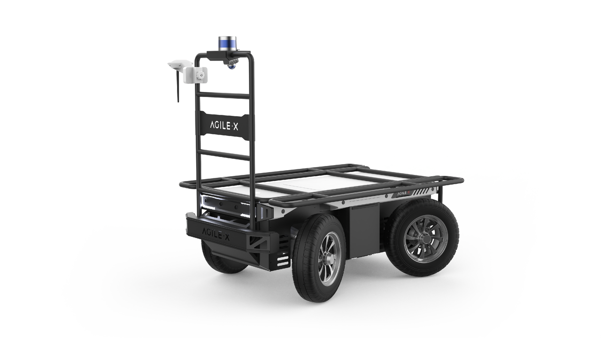

# ROS Packages for Titan Robot

This repository contains ROS support packages for the Titan robot bases to provide a ROS interface to the robot.

## Supported hardware

* Titan
  

## Build the package

1. Install dependencies

```bash
$ sudo apt install libasio-dev libboost-all-dev
```

2. Clone and build the packages in a catkin workspace

```bash
$ cd ~/catkin_ws/src
$ git clone https://github.com/agilexrobotics/ugv_sdk.git
$ git clone https://github.com/agilexrobotics/titan_ros.git
$ cd ..
$ catkin_make
```
3. Setup CAN-To-USB adapter

* Enable gs_usb kernel module(If you have already added this module, you do not need to add it)
    ```
    $ sudo modprobe gs_usb
    ```
    
* first time use scout-ros package
   ```
   $ rosrun titan_bringup setup_can2usb.bash
   ```
   
* if not the first time use scout-ros package(Run this command every time you turn off the power) 
   ```
   $ rosrun titan_bringup bringup_can2usb.bash
   ```
   
* Testing command
    ```
    # receiving data from can0
    $ candump can0
    ```

4. Launch ROS nodes

* Start the base node for titan

    ```shell
    $ roslaunch titan_bringup titan.launch #for titan
    ```


## ROS interface

### Parameters

* can_device (string): **can0**
* robot_model (string): **titan**
* update_rate (int): **50**
* base_frame (string): **base_link**
* odom_frame (string): **odom**
* publish_odom_tf (bool): **true**
* odom_topic_name (string): **odom**

### Published topics

* /system_state (titan_msgs::SystemState)
* /actuator_state (titan_msgs::ActuatorStateArray)
* /odom (nav_msgs::Odometry)
* /battery_state (titan_msgs::BatteryState)

### Subscribed topics

* /cmd_vel (geometry_msgs::Twist)
